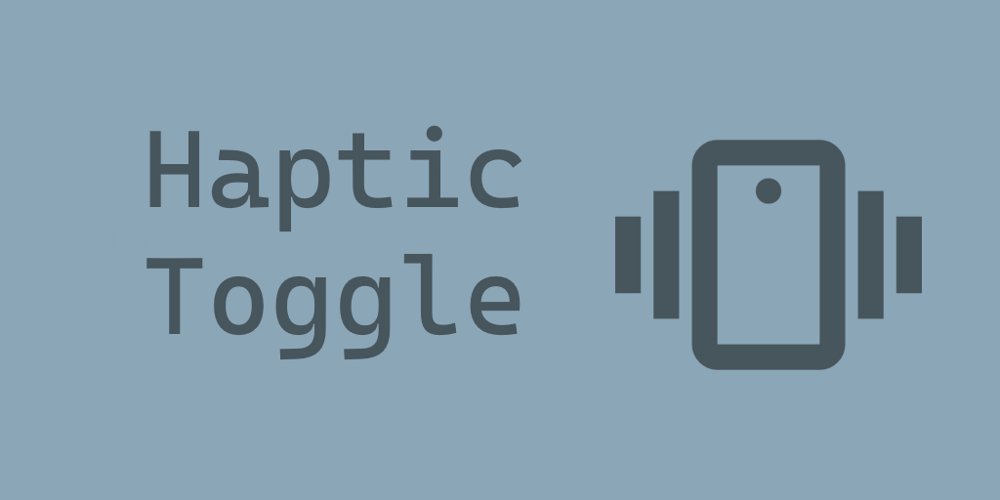
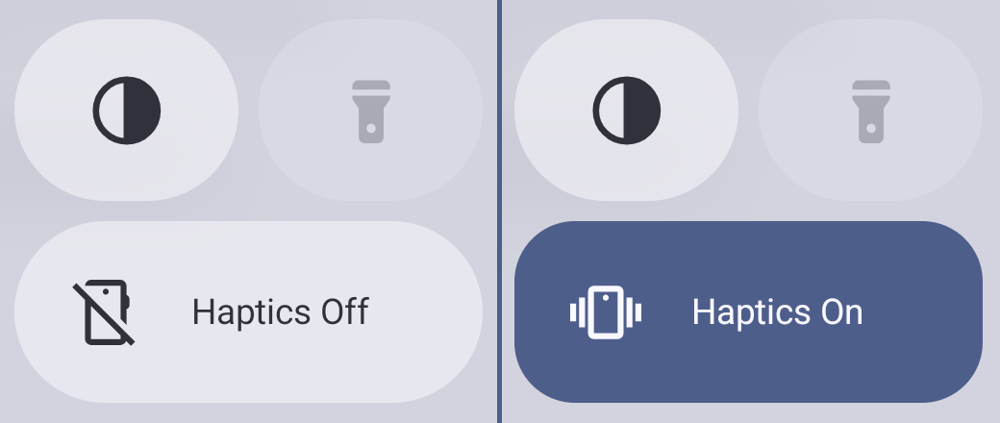
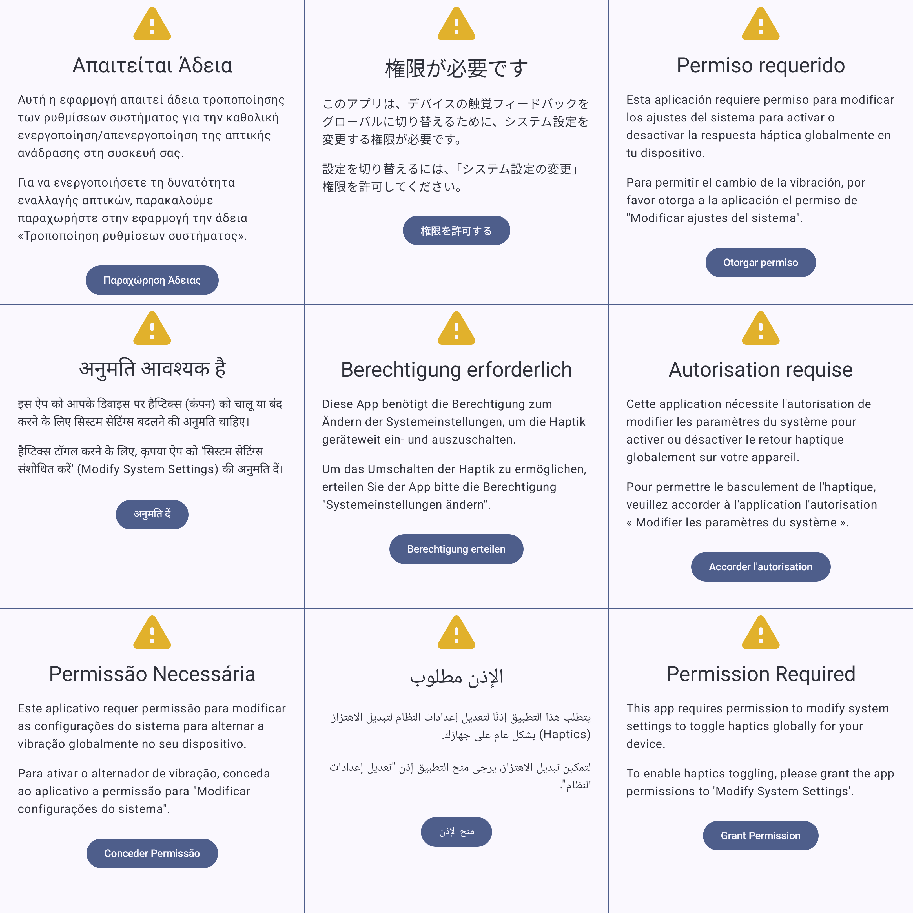

I recently got back into Android development after a *bit* of an absence. I used to tinker and play
around a lot with it, way back in the Android 2 (Eclair/Froyo) and 3 (Honeycomb) days.

Things have changed a lot in 15 years!

## The Problem

On my Google Pixel 9, the haptic motor is excellent; maybe a little *too* excellent. At night, when
I'm scrolling and typing in bed, the haptic feedback is actually loud enough to disturb my wife.

Turning the haptics off is possible, but the setting is buried 2 screens deep. It's not something
you want to dig for every night and morning.

## The Solution

I wanted a quicker solution, and an evening project. I figured it was within my skill range to put
together a **Quick Settings Tile** to toggle haptics globally for the phone. Thus, **HapticToggle**
was born!

The idea is simple: guide the user through granting the necessary permissions, then add a tile to
the notification shade to toggle vibration on and off with a single tap.

### Under the Hood

To change system settings like haptic feedback programmatically, the app needs the [`WRITE_SETTINGS`](https://developer.android.com/reference/android/Manifest.permission#WRITE_SETTINGS)
permission.

Google is very clear that this is a powerful permission. It cannot be granted automatically; the
user must be well informed about why you're requesting it, and directed to a system settings
page to grant the permissions.

The core feature utilises the [**Quick Settings Tile API**](https://developer.android.com/develop/ui/views/quicksettings-tiles).

It works great! I also added a "quick-add" button within the app to prompt the user to add the tile,
as it doesn't automatically appear in your active tiles after installation.

The code is completely open source, and available on GitHub.



### Quality of Life: UI Testing & Localisation

For this project, I played around with UI Automation testing. I ended up using it to [capture screenshots](https://github.com/liamjpeters/HapticToggle/blob/main/app/src/androidTest/java/uk/co/liampeters/haptictoggle/GenerateScreenshots.kt)
of the app in various states automatically.

I also used AI to localise the app into the 9 most popular languages on the Play Store.

## Publishing to the Play Store

In an effort to increase the quality of apps submitted to the Play Store, Google now requires personal developers to run a **Closed Testing** track with at least 12 testers for 14 days before publishing an app publicly.

This is a bit of a hurdle for a small utility app, but rules are rules. If you have an Android device and want to help me out (or just need to quiet your own phone's haptics), you can join the test below.


