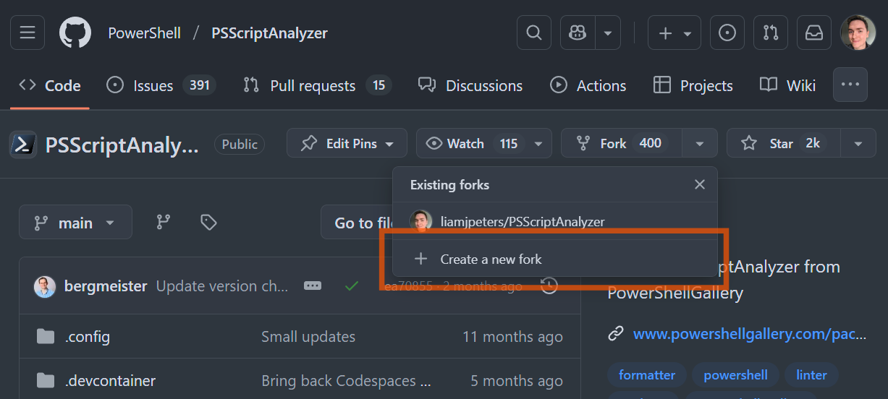
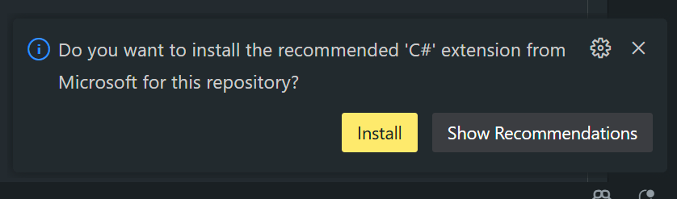
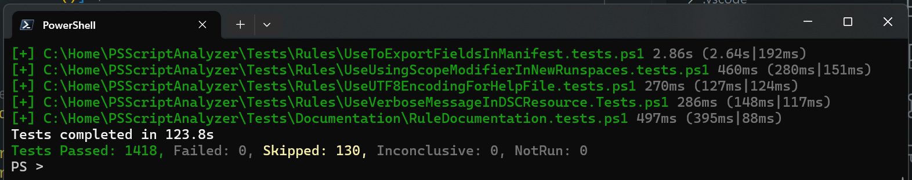

PSScriptAnalyzer is a static code analysis tool for PowerShell scripts. It
provides a set of rules to enforce best practices and detect potential issues in
your code. The rules are based on PowerShell best practices identified by the 
PowerShell Team and the community.

There is so much scope for contribution in this project and the potential to
help others by contributing to it is enormous.

This series will be a loose collection of articles centered on contributing to
PSScriptAnalyzer; be it new rules, bug fixes, or documentation improvements. To
start off with, I'll get a development environment set up and go through the
basics of building and testing the module.

## VS Code

There are a few IDEs that you could use to work on PSScriptAnalyzer (or any .NET
project); [Visual Studio](https://visualstudio.microsoft.com/),
[Visual Studio Code](https://code.visualstudio.com/), and 
[Jetbrains Rider](https://www.jetbrains.com/rider/) to name some popular
choices.

In this series, I'll be using Visual Studio Code for its simplicity and ease of
use. Download it for your system from the [VS Code website](https://code.visualstudio.com/download).

### Extensions

The ability to customise VS Code to suit your workflow is one of its greatest
strengths. Customisation comes by way of extensions. Extensions can be almost
anything - themes, icon packs, language support etc. Here are some recommended
extensions for working with PowerShell and .NET projects:

- [PowerShell](https://marketplace.visualstudio.com/items?itemName=ms-vscode.PowerShell) -
    This is the official PowerShell extension for VS Code. It provides syntax
    highlighting, IntelliSense, debugging, and more.
- [PowerShell AST Inspector](https://marketplace.visualstudio.com/items?itemName=liamjpeters.powershell-ast-inspector) -
    Allows you to view the AST of a script. It's great, though admittedly I'm
    biased as it's an extension I developed.
- [C#](https://marketplace.visualstudio.com/items?itemName=ms-dotnettools.csharp) -
    Adds C# language support. This will also install [.NET Install Tool](https://marketplace.visualstudio.com/items?itemName=ms-dotnettools.vscode-dotnet-runtime)
    which you can use to manage .NET installs.
- [C# Dev Kit](https://marketplace.visualstudio.com/items?itemName=ms-dotnettools.csdevkit) -
    Provides a lot of niceties for C# development in VS Code.
- [Pester Tests](https://marketplace.visualstudio.com/items?itemName=pspester.pester-test) -
    This extension provides support for running and debugging Pester tests in VS Code.


### Settings

VS Code is incredibly configurable. Almost all settings are personal preference,
so experiment and find what works for you.

You may want to add the following to your `settings.json` file.

```json
// I use the LTS PowerShell (currently 7.4.11). The prompts to update to version
// 7.5 can be disabled with this setting
"powershell.promptToUpdatePowerShell": false,

// This setting disables the Pester code lens and is recommended by the Pester
// Tests extension
"powershell.pester.codeLens": false,

// When the integrated console starts, suppress the startup banner
"powershell.integratedConsole.suppressStartupBanner": true,

// This setting controls whether the integrated console is shown on startup
// It doesn't prevent it loading, just doesn't open the terminal panel
// automatically
"powershell.integratedConsole.showOnStartup": false,

// I'm on Windows and want PowerShell (x64) - PowerShell 7.4 as the default
// version
"powershell.powerShellDefaultVersion": "PowerShell (x64)"

// This setting enables bracket pair guides, highlighting matching bracket pairs
"editor.guides.bracketPairs": "active",
"editor.guides.bracketPairsHorizontal": "active",

// This setting adds vertical visual rulers/guides at the specified columns. I
// find this helpful for keeping code within a certain width for readability.
"editor.rulers": [
    80,
    100
],

// I don't like the default behavior of showing references, code lens and
// minimap. I find it distracting, so I disable them.
"editor.suggest.showReferences": false,
"editor.codeLens": false,
"editor.minimap.enabled": false

// Being able to visually see if I have trailing whitespace characters is
// helpful
"editor.renderWhitespace": "trailing",

// I like to start with a blank editor when I load VS Code
"workbench.startupEditor": "none",
```

## Git

The PSScriptAnalyzer project is hosted on GitHub and uses Git for version
control. You will need [git installed](https://docs.github.com/en/get-started/git-basics/set-up-git)
and a [GitHub account](https://docs.github.com/en/get-started/start-your-journey/creating-an-account-on-github)
setup in order to contribute.

Start by forking the [PSScriptAnalyzer repository](https://github.com/PowerShell/PSScriptAnalyzer)
on GitHub.



Clicking the `Create a new fork` button will show a dialog prompting you to
create the fork - keep the default settings.

This creates a new repository under your GitHub account. You are free to
experiment and make changes to this repository without those changes affecting
the original.

If you're using the GitHub CLI, you can fork the repository with the following
command:

```powershell
gh repo fork https://github.com/PowerShell/PSScriptAnalyzer
```

Next, clone your fork of the repository to your local machine:

```powershell
git clone https://github.com/{USERNAME}/PSScriptAnalyzer
```

Navigate into the cloned directory:

```powershell
cd PSScriptAnalyzer
```

And open it in VS Code:

```powershell
code .
```

Opening the cloned repository in Visual Studio Code may prompt you to install
the C# extension. This is strongly recommended, and required for making best use
of VS Code.



The C# extension also prompts to install the .NET SDK, if not already installed - 
which is very helpful.

We can test everything is set up correctly by building the project and running
the suite of pester tests.

## Building the Module

The project comes with a build script `build.ps1` which takes care of building,
generating documentation, and running tests. We just need to tell it what we
want it to do.

To build the module for both .NET Framework (`PS5.1`) and .NET Core (`PS7+`), we
run:

```powershell
.\build.ps1 -All
```

Alternatively, to specify a PowerShell version, run:

```powershell
.\build.ps1 -PSVersion 7 # '5' is also an option.
```

> **Note:** PSScriptAnalyzer [recently dropped support for](https://github.com/PowerShell/PSScriptAnalyzer/pull/2081) PowerShell versions 3
> and 4

It will dump the built module into the `out` directory.

```txt {linenos=false}
📁 PSScriptAnalyzer
└── 📁 1.24.0
    ├── 📄 LICENSE
    ├── 📄 Microsoft.PowerShell.CrossCompatibility.dll
    ├── 📄 Microsoft.PowerShell.CrossCompatibility.pdb
    ├── 📄 Microsoft.Windows.PowerShell.ScriptAnalyzer.BuiltinRules.dll
    ├── 📄 Microsoft.Windows.PowerShell.ScriptAnalyzer.BuiltinRules.pdb
    ├── 📄 Microsoft.Windows.PowerShell.ScriptAnalyzer.dll
    ├── 📄 Microsoft.Windows.PowerShell.ScriptAnalyzer.pdb
    ├── 📄 Newtonsoft.Json.dll
    ├── 📄 PSScriptAnalyzer.psd1
    ├── 📄 PSScriptAnalyzer.psm1
    ├── 📄 README.md
    ├── 📄 ScriptAnalyzer.format.ps1xml
    ├── 📄 ScriptAnalyzer.types.ps1xml
    ├── 📄 SECURITY.md
    ├── 📄 ThirdPartyNotices.txt
    ├── 📁 compatibility_profiles
    ├── 📁 en-US
    ├── 📁 PSv7
    └── 📁 Settings
```

You should also ensure the documentation is built too:

```powershell
.\build.ps1 -Documentation
```

This will install the `PlatyPS` module, if you don't already have it. `PlatyPS`
is used to turn the Markdown help files into the proper help format.

You can import the built module and test it out:

```powershell
Import-Module '.\out\PSScriptAnalyzer\'
```

> **Note:** Don't try to do this in the PowerShell Extension terminal in VSCode.
> It already has its own version of PSScriptAnalyzer loaded and it will likely
> fail with an error such as `Import-Module: Assembly with same name is
> already loaded`

## Running Tests

Now we can test the built copy of the module by running the Pester tests. It's
important to check the tests all pass before we start making any changes.

This way we can more easily see if we cause unintended failures down the line. 

Start with a clean slate!

To run the test suite, run:

```powershell
.\build.ps1 -Test
```

I like to run the tests in a separate PowerShell session to avoid any issues
with the PowerShell Extension in VSCode.

If you get any failures, you can investigate them in the test output. If any
relate to the documentation, ensure you've built it and re-test!

All being well you'll 



Great, all tests passing, we can make a start on our new rule!

## Good Git Hygiene

Always work on features and fixes in a branch that's based on the default
branch. This helps keep your changes organized and makes it easier to integrate
them back into the main codebase.

To create and checkout a branch that's based on the default branch run:

```powershell
git checkout -b my-feature-branch origin/master
```

Make sure your branch name is descriptive.

## New Rule

Next up we'll look at creating a new rule.