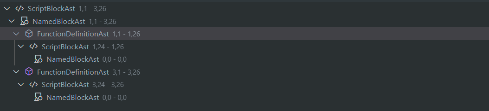
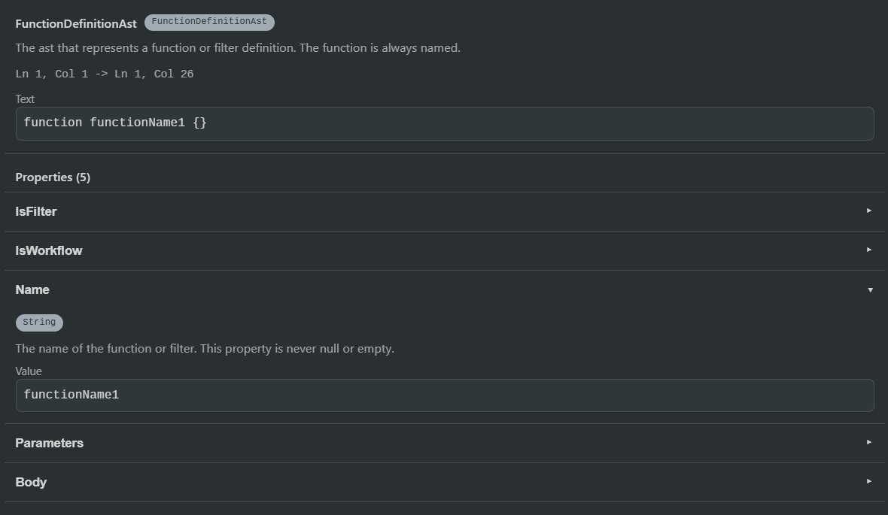
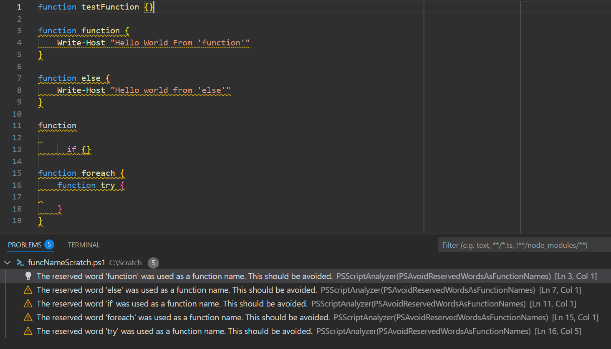
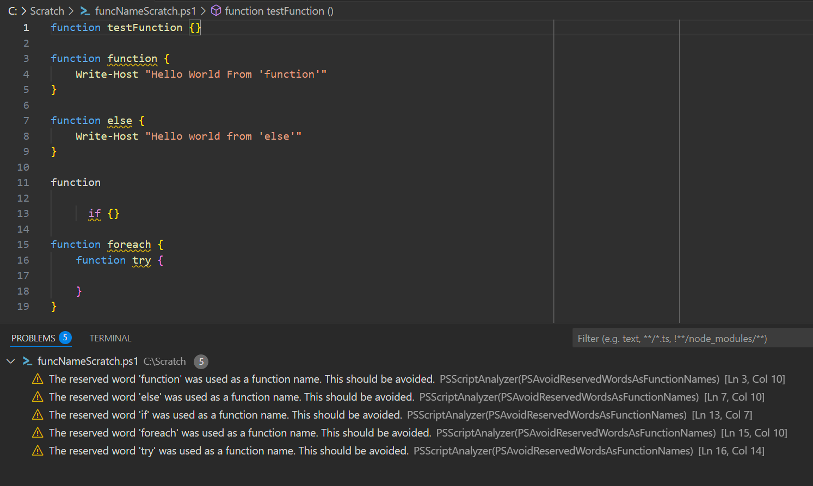
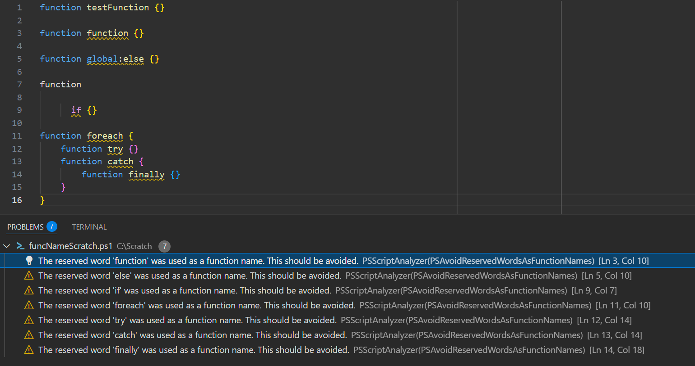
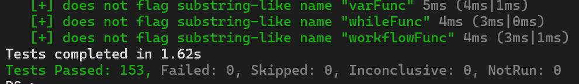
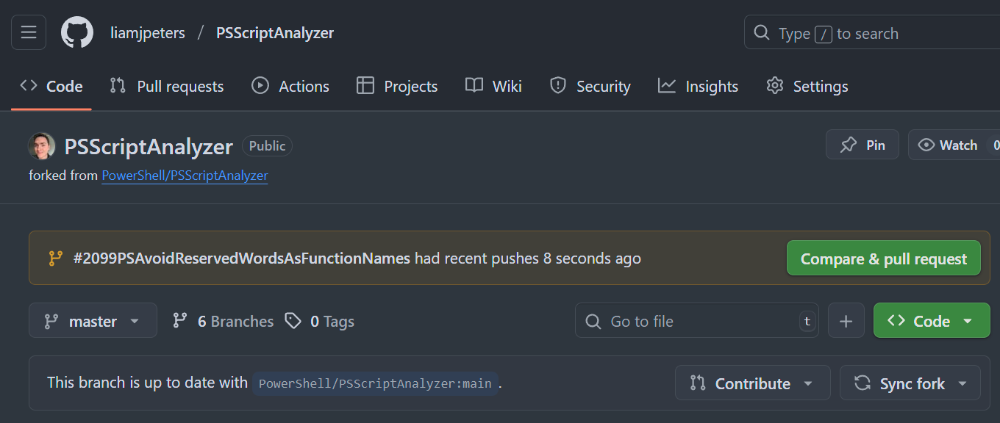
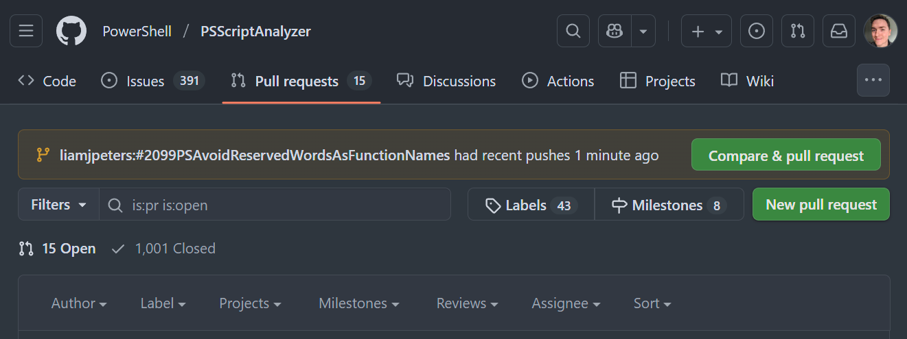
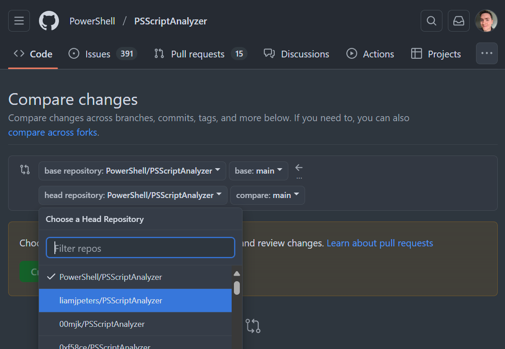
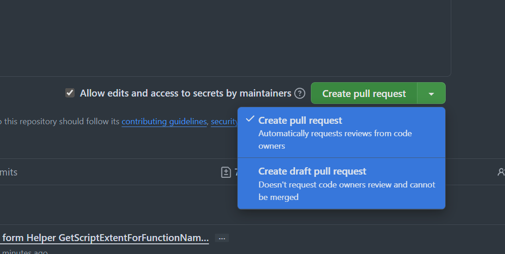

Issues are a great place to start when looking to contribute. They're used to
track bugs, enhancements, and new feature requests. They provide a way for the
community to discuss and prioritise.

You can view the open issues on the [GitHub repository](https://github.com/PowerShell/PSScriptAnalyzer/issues).

## Issue

Issue [PowerShell/PSScriptAnalyzer#2099](https://github.com/PowerShell/PSScriptAnalyzer/issues/2099)
from user [iRon7](https://github.com/iRon7) highlights that it's possible to
create functions with names that are reserved words in PowerShell. The below are
all allowed:

```powershell
function function {
    Write-Host "Hello from 'Function'"
}

function exit {
    Write-Host "Hello from 'Exit'"
}

function throw {
    Write-Host "Hello from 'Throw'"
}
```

You wouldn't be able to use these like any normal function. You'd need to use
the call operator (`&`) to invoke them:

```powershell
& function
& exit
& throw
```

PowerShell is, by design, very permissive. The language doesn't want to get in
your way. 

That said, just because you *can*, doesn't mean that you *should*; Enter 
PSScriptAnalyzer.

We can write a rule that analyses a script and checks the names of all defined
functions. It will warn if any of them are reserved words so the user can make
an informed choice; chances are it's a mistake and they hadn't realised.

## Reserved Words

A list of reserved words can be found under help topic [`about_Reserved_Words`](https://learn.microsoft.com/en-gb/powershell/module/microsoft.powershell.core/about/about_reserved_words).

```txt {linenos=false}
assembly            else                type                hidden
base                elseif              until               if
begin               end                 using               in
break               enum                var (*)             inlinescript
catch               process             while               interface
class               public              workflow            module
command             return              exit                namespace
configuration       sequence            filter              parallel
continue            static              finally             param
data                switch              for                 private
define (*)          throw               foreach
do                  trap                from (*)
dynamicparam        try                 function
```

*`(*)` are not currently used but are reserved for future use.*

## Branching

We'll create a feature branch to work in that's based on the current default
branch.

I like to include the issue reference in the branch name where possible.

I think the rule name should be `PSAvoidReservedWordsAsFunctionNames` - so we'll
use that too.

Ultimately your branch name doesn't matter - but be descriptive - future you
may thank you.

```powershell
git checkout -b '#2099PSAvoidReservedWordsAsFunctionNames' origin/master
```

To start with a clean slate, we'll first build and run the tests on our new
branch. It's important we know we're starting in a known good state.

With tests all passing, we can get to work.

## Scaffolding

Rules are defined in the `Rules` project, as classes in the `Microsoft.Windows.PowerShell.ScriptAnalyzer.BuiltinRules`
namespace that implement the `IScriptRule` interface.

Let's create a new rule file: [`Rules\AvoidReservedWordsAsFunctionNames.cs`](https://github.com/liamjpeters/PSScriptAnalyzer/blob/59b69c8a379b0cf5e857620fe9e51fb93dcbbd52/Rules/AvoidReservedWordsAsFunctionNames.cs)

```csharp
// Copyright (c) Microsoft Corporation. All rights reserved.
// Licensed under the MIT License.

using Microsoft.Windows.PowerShell.ScriptAnalyzer.Generic;
using System;
using System.Collections.Generic;
using System.Globalization;
using System.Management.Automation.Language;
#if !CORECLR
using System.ComponentModel.Composition;
#endif

namespace Microsoft.Windows.PowerShell.ScriptAnalyzer.BuiltinRules
{
#if !CORECLR
    [Export(typeof(IScriptRule))]
#endif

    /// <summary>
    /// Rule that warns when reserved words are used as function names
    /// </summary>
    public class AvoidReservedWordsAsFunctionNames : IScriptRule
    {

        /// <summary>
        /// Analyzes the PowerShell AST for uses of reserved words as function names.
        /// </summary>
        /// <param name="ast">The PowerShell Abstract Syntax Tree to analyze.</param>
        /// <param name="fileName">The name of the file being analyzed (for diagnostic reporting).</param>
        /// <returns>A collection of diagnostic records for each violation.</returns>
        public IEnumerable<DiagnosticRecord> AnalyzeScript(Ast ast, string fileName)
        {
            if (ast == null)
            {
                throw new ArgumentNullException(Strings.NullAstErrorMessage);
            }
            return new List<DiagnosticRecord>();
        }

        public string GetCommonName() => Strings.AvoidReservedWordsAsFunctionNamesCommonName;

        public string GetDescription() => Strings.AvoidReservedWordsAsFunctionNamesDescription;

        public string GetName() => string.Format(
                CultureInfo.CurrentCulture,
                Strings.NameSpaceFormat,
                GetSourceName(),
                Strings.AvoidReservedWordsAsFunctionNamesName);

        public RuleSeverity GetSeverity() => RuleSeverity.Warning;

        public string GetSourceName() => Strings.SourceName;

        public SourceType GetSourceType() => SourceType.Builtin;
    }
}
```

There's lots there, so let's break it down.

- At the very top we have the copyright header - this **must** be present for
  all source files committed to the repository.

- There's a `using` directive and an export attribute which are required for 
  .NET Framework - so they're guarded by a preprocessor directive. Since the
  project is targeting both .NET Framework and .NET Core, this needs to be here.

- The rule class is declared, implementing the `IScriptRule` interface and its
  required interface members.

- The `AnalyzeScript` method is what's called when the rule is run against
  a PowerShell script. It's where the logic for identifying violations and
  emitting diagnostic records will be implemented. Currently we're just
  returning an empty list - effectively doing nothing.

- Lastly there are several convenience methods defined to help with rule
  metadata. They're used to provide additional information about the rule, such
  as its name, description, and severity.

Currently we have an error, preventing us from building the project. We've used
several string resources that we've not yet defined.

They need to be added to the [`Rules/Strings.resx`](https://github.com/liamjpeters/PSScriptAnalyzer/blob/%232099PSAvoidReservedWordsAsFunctionNames/Rules/Strings.resx)
file.

```xml
<data name="AvoidReservedWordsAsFunctionNamesCommonName" xml:space="preserve">
    <value>Avoid Reserved Words as function names</value>
</data>
<data name="AvoidReservedWordsAsFunctionNamesDescription" xml:space="preserve">
    <value>Avoid using reserved words as function names. Using reserved words as function names can cause errors or unexpected behavior in scripts.</value>
</data>
<data name="AvoidReservedWordsAsFunctionNamesName" xml:space="preserve">
    <value>AvoidReservedWordsAsFunctionNames</value>
</data>
<data name="AvoidReservedWordsAsFunctionNamesError" xml:space="preserve">
    <value>The reserved word '{0}' was used as a function name. This should be avoided.</value>
</data>
```

Adding them in, you'll notice we've also added another,
`AvoidReservedWordsAsFunctionNamesError`. We're going to need this shortly. It
will be the text of the warning that gets reported when a reserved word is used
as a function name. The `{0}` is a placeholder for the offending function name.

Building now will succeed, but running the tests shows some other issues:

- [`GetScriptAnalyzerRule.tests.ps1`](https://github.com/PowerShell/PSScriptAnalyzer/blob/ea70855e9d6de8c214757b4dad7b6ed92e8348c8/Tests/Engine/GetScriptAnalyzerRule.tests.ps1)
  expected 70 built-in rules but found 71.
- [`RuleDocumentation.tests.ps1`](https://github.com/PowerShell/PSScriptAnalyzer/blob/ea70855e9d6de8c214757b4dad7b6ed92e8348c8/Tests/Documentation/RuleDocumentation.tests.ps1)
  reports that our rule doesn't have an entry in the main README.md rules file.
- [`RuleDocumentation.tests.ps1`](https://github.com/PowerShell/PSScriptAnalyzer/blob/ea70855e9d6de8c214757b4dad7b6ed92e8348c8/Tests/Documentation/RuleDocumentation.tests.ps1)
  reports that our rule doesn't have a documentation file.

Let's address these issues before we move on.

Firstly, we update the number of tests in that test file to `71`; nice and
simple!

Secondly, we add an entry for our new rule in the [`docs/Rules/README.md`](https://github.com/liamjpeters/PSScriptAnalyzer/blob/59b69c8a379b0cf5e857620fe9e51fb93dcbbd52/docs/Rules/README.md)
file, in the `PSScriptAnalyzer Rules` table. We list it as enabled by default
and of `Warning` severity.

Lastly we create a markdown documentation file for our new rule. This file goes
in the `docs/Rules` folder.

[`AvoidReservedWordsAsFunctionNames.md`](https://github.com/liamjpeters/PSScriptAnalyzer/blob/59b69c8a379b0cf5e857620fe9e51fb93dcbbd52/docs/Rules/AvoidReservedWordsAsFunctionNames.md):

~~~md
---
description: Avoid reserved words as function names
ms.date: 08/31/2025
ms.topic: reference
title: AvoidReservedWordsAsFunctionNames
---
# AvoidReservedWordsAsFunctionNames

**Severity Level: Warning**

## Description

Avoid using reserved words as function names. Using reserved words as function
names can cause errors or unexpected behavior in scripts.

## How to Fix

## Example

### Wrong

```powershell
# function is a reserved word
function function {
    Write-Host "Hello, World!"
}
```

### Correct

```powershell
# myFunction is not a reserved word
function myFunction {
    Write-Host "Hello, World!"
}
```
~~~

Running the tests now - we get green across the board!

## AST

Our rule currently does absolutely nothing. We still need to implement the logic
to analyse the script and report any violations.

In the `AnalyzeScript` method, we're passed the AST representation of the
script being analysed.

AST is the Abstract Syntax Tree; a representation of the structure of the code.

Let's look at the AST of a simple PowerShell script using the [PowerShell AST Inspector](https://marketplace.visualstudio.com/items?itemName=liamjpeters.powershell-ast-inspector)
VS Code extension. Running it on the below simple script:

```powershell
function functionName1 {}

function functionName2 {}
```



We can see that there are two function definitions in the AST. These are of type
`FunctionDefinitionAst`.

Looking at the properties of one of the `FunctionDefinitionAst` instances, we
can see we have access to the `Name` property of the function. Helpfully the
documentation tells us that this property is never null or empty. Any function
without a name is a parser error.




## Analyse and Diagnose

We can now implement the core logic of the rule.

Let's start by defining a list of all the reserved words in PowerShell. We need
this to check function names against.

As we just want to quickly check if the function name is
in the list, ignoring case, we can use a `HashSet<string>` for fast lookups.

With an `OrdinalIgnoreCase` comparer, we ensure that our checks are
case-insensitive and fast.

```csharp
static readonly HashSet<string> reservedWords = new HashSet<string>(
    new[] {
        "assembly", "base", "begin", "break",
        "catch", "class", "command", "configuration",
        "continue", "data", "define", "do",
        "dynamicparam", "else", "elseif", "end",
        "enum", "exit", "filter", "finally",
        "for", "foreach", "from", "function",
        "hidden", "if", "in", "inlinescript",
        "interface", "module", "namespace", "parallel",
        "param", "private", "process", "public",
        "return", "sequence", "static", "switch",
        "throw", "trap", "try", "type",
        "until", "using","var", "while", "workflow"
    },
    StringComparer.OrdinalIgnoreCase
);
```

Next we find all of the `FunctionDefinitionAst` nodes in the AST.

```csharp
var functionDefinitions = ast.FindAll(
    astNode => astNode is FunctionDefinitionAst,
    true
).Cast<FunctionDefinitionAst>();
```

For each function definition we can ask if the function's name is in our list of
reserved words, and if it is, emit a warning.

```csharp
foreach (var function in functionDefinitions)
{
    if (reservedWords.Contains(function.Name))
    {
        yield return new DiagnosticRecord(
            string.Format(
                CultureInfo.CurrentCulture,
                Strings.AvoidReservedWordsAsFunctionNamesError,
                function.Name),
            function.Extent,
            GetName(),
            DiagnosticSeverity.Warning,
            fileName
        );
    }
}
```

We'll go over the `DiagnosticRecord` class in more detail another time, but for
now, just know that it takes a message to display, an extent (the start and
stop locations) of the issue, the name of the rule, the severity of the issue,
and the file name. It can optionally take other things, but for now that's it.

Our rule now works! 🥳

Building the module and hacking it into VS Code (*outside the scope of this
article*) shows it in action.



We see yellow squigglies covering the functions that use reserved words as their
name.

Seeing it in action I think we need to tweak the yellow squigglies. They're
currently highlighting the entire function definition - which is a bit visually
noisy. It would be better if it just highlighted the offending function's name.

This squiggly line comes from the extent we use when we create the
`DiagnosticRecord`. We're using the `function.Extent` currently - which is the
entire function definition. Instead we need to get an extent for just the
function's name.

To achieve that, we can use a helper function from the [`Engine\Helper.cs`](https://github.com/liamjpeters/PSScriptAnalyzer/blob/59b69c8a379b0cf5e857620fe9e51fb93dcbbd52/Engine/Helper.cs)
class. Modifying our code to use:

```csharp
if (reservedWords.Contains(function.Name))
{
    yield return new DiagnosticRecord(
        string.Format(
            CultureInfo.CurrentCulture,
            Strings.AvoidReservedWordsAsFunctionNamesError,
            function.Name),
        Helper.Instance.GetScriptExtentForFunctionName(function) ?? function.Extent,
        GetName(),
        DiagnosticSeverity.Warning,
        fileName
    );
}
```

Building that and bringing it into VS Code, things are looking much better!



While playing about in VS Code, I noticed that we don't handle the case when
functions are defined with a scope.

```powershell
function global:else {}
```

Inspecting the AST, the function's name is reported as the whole name, including
the scope - `global:else`.

This is already a solved problem in the codebase and there's a helper function
to strip the scope from the function name; `FunctionNameWithoutScope`.

We can use this helper function in our rule and it now handles this situation
as you'd expect.

```csharp
if (reservedWords.Contains(
    Helper.Instance.FunctionNameWithoutScope(function.Name)
))
{
    yield return new DiagnosticRecord(
        string.Format(
            CultureInfo.CurrentCulture,
            Strings.AvoidReservedWordsAsFunctionNamesError,
            function.Name),
        Helper.Instance.GetScriptExtentForFunctionName(function) ?? function.Extent,
        GetName(),
        DiagnosticSeverity.Warning,
        fileName
    );
}
```


So we're done right - 🚢 Ship it? 

*Almost* but not quite! We still need to write a comprehensive set of unit
tests.

## Testing

Tests in the project are written in Pester, the de facto standard testing
framework for PowerShell.

We create a new file in the `Tests/Rules/` folder [for our new rule](https://github.com/liamjpeters/PSScriptAnalyzer/blob/59b69c8a379b0cf5e857620fe9e51fb93dcbbd52/Tests/Rules/AvoidReservedWordsAsFunctionNames.tests.ps1).

I won't go through the whole file, but in general we're trying to cover off the
positive (when our rule should alert) and negative (when our rule should not
alert) cases for our rule.

To write tests, I like to think through the `Should` and `Should not` statements
that apply to the rule. For example:

- The rule **should** alert when a function is defined with a reserved word as
  its name.
- The casing of the defined function name **should not** matter.
- The rule **should** flag the name of the function as the issue
  location/Extent.
- The warning message **should** be coming from our rule and **should** include
  the offending function's name.
- The rule **should not** alert when a function is defined with a non-reserved
  word as its name.
- The rule **should not** alert when a function name *contains* a reserved word
  as a substring. (i.e. a name of `function` should alert, but `myFunction`
  should not).

We can translate these `Should` and `Should not` statements into Pester tests.

We have a string array called `$reservedWords` that contains the names of all
reserved words in PowerShell. We can use this array to drive our tests.

```powershell
Describe 'AvoidReservedWordsAsFunctionNames' {
	Context 'When function names are reserved words' {
		It 'flags reserved word "<_>" as a violation' -TestCases $reservedWords {

			$scriptDefinition = "function $_ { 'test' }"
			$violations = Invoke-ScriptAnalyzer -ScriptDefinition $scriptDefinition -IncludeRule @($ruleName)

			$violations.Count | Should -Be 1
			$violations.Severity | Should -Be 'Warning'
			$violations.RuleName | Should -Be $ruleName
			$violations.Message | Should -Be "The reserved word '$_' was used as a function name. This should be avoided."
			$violations.Extent.Text | Should -Be $_
		}
    }
}
```

[Pester's data-driven tests](https://pester.dev/docs/usage/data-driven-tests#using--foreach---testcases-with-an-array)
are great for covering a wide range of scenarios without duplicating code. We
can easily run the same test for each reserved word. Above we're defining a
function with the current test case as its name, i.e. `function function { ... }`.
We can then run our rule on that definition. We make checks about the resulting
violation(s) to ensure they match our expectations. For instance:

- `$violations.Count | Should -Be 1` - we get exactly 1 violation.
- `$violations.Severity | Should -Be 'Warning'` - the violation we got was a
  warning.
- `$violations.RuleName | Should -Be $ruleName` - the violation came from our
  rule.
- `$violations.Message | Should -Be "The reserved word '$_' wa...` - The
  message matched what we expected it to.
- `$violations.Extent.Text | Should -Be $_` - the extent of the violation is
    just the name of the function - not the whole function definition.

The test statements *should* be easy to read and fairly close to an English
statement. e.g. `$violations.Count | Should -Be 1` reads as  `"Violations count
should be one"`. Zero ambiguity as to what that test means!

Running our tests we get all passes.



## Pull Request

Now that we're done writing, documenting, and testing our rule - we can commit
it to our local branch and push that local branch to our remote repository on
GitHub.

```powershell
# Make sure you only add files you've changed that directly relate to the
# implementation of the new rule. Avoid any random formatting changes that you
# or your IDE made to unrelated files! Consider git add -p to make tactical
# additions.
git add .
git commit -m "Add new rule to avoid reserved words as function names"
git push origin '#2099PSAvoidReservedWordsAsFunctionNames'
```

Now that GitHub has our branch and changes, we can open our Pull Request.

Going to our fork on GitHub, it's helpfully suggesting that we may want to open
a Pull Request.



GitHub is helpful that way - I'd recommend clicking it. If you happen to dismiss
or wait long enough that the prompt goes away, you can go to the main repo page
and create a Pull Request from there - click the `New` button on the `Pull
Requests` tab.



You'll then need to tell it you want to `Compare across forks` for your forked
repo to show up and be able to select your branch



Once you've selected your fork and branch, you can click `Create pull request`.

When creating a new PR, there's a template that you should populate (it will
come up automatically, don't delete it):

~~~markdown
## PR Summary

<!-- summarize your PR between here and the checklist -->

## PR Checklist

- [ ] [PR has a meaningful title](https://github.com/PowerShell/PowerShell/blob/master/.github/CONTRIBUTING.md#pull-request---submission)
    - Use the present tense and imperative mood when describing your changes
- [ ] [Summarized changes](https://github.com/PowerShell/PowerShell/blob/master/.github/CONTRIBUTING.md#pull-request---submission)
- [ ] [Change is not breaking](https://github.com/PowerShell/PowerShell/blob/master/.github/CONTRIBUTING.md#making-breaking-changes)
- [ ] [Make sure all `.cs`, `.ps1` and `.psm1` files have the correct copyright header](https://github.com/PowerShell/PowerShell/blob/master/.github/CONTRIBUTING.md#pull-request---submission)
- [ ] Make sure you've added a new test if existing tests do not effectively test the code changed and/or updated documentation
- [ ] This PR is ready to merge and is not [Work in Progress](https://github.com/PowerShell/PowerShell/blob/master/.github/CONTRIBUTING.md#pull-request---work-in-progress).
    - If the PR is work in progress, please add the prefix `WIP:` to the beginning of the title and remove the prefix when the PR is ready.
~~~

So we need to write a description of our Pull Request and check off each item
in the list.

Once we've done that, we're ready to submit.

> **Tip:** If your PR resolves an open issue (do a search of the issues) then you
> can link it by [using a keyword](https://docs.github.com/en/issues/tracking-your-work-with-issues/using-issues/linking-a-pull-request-to-an-issue#linking-a-pull-request-to-an-issue-using-a-keyword)
> followed by the issue number. e.g. `fixes #1234` or `closes #1234`. This
> links the PR to the issue - which lets the issue author know that a fix is in
> the works.

> **Tip:** If your PR still needs work, you can prefix the title with `'WIP:'`
> and you can also open the PR as draft.
> 

## Submission

Now we're done; our Pull Request submitted. The maintainers are busy people with
plenty else on their plates. A little patience helps when it comes to the review
process. It will get looked at in time!

The project maintainers will review the changes and provide feedback. The
community can also provide you feedback should they think it would be helpful.

It's important to take feedback in the way it's intended - constructively. It's
not a personal criticism of your work, but rather a way to improve the overall
quality of the project. Be open to suggestions and willing to make changes
based on the feedback you receive. That's not to say you have to accept every
piece of feedback you get. It's okay to have a discussion about the feedback
and come to a mutual understanding.

Our rule seems pretty niche, but imagine someone starting out with PowerShell -
wondering why their function (called 'function') isn't working! Having some
guard rails to keep them on track and warning them when they may be doing
something inadvisable can be really helpful.

I find it really rewarding to work through these issues - pick them apart and
get to the root of the issues and fix them.

That's it! I'll update this post in the future to let you know how my little PR
gets on!