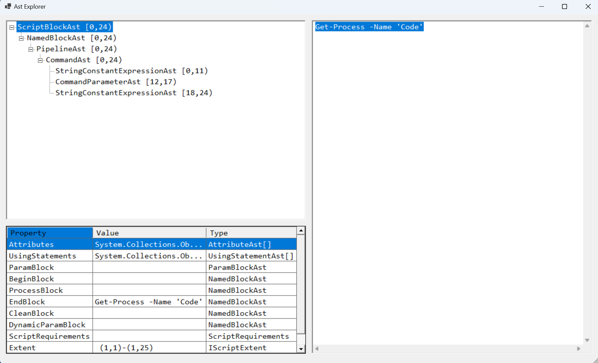
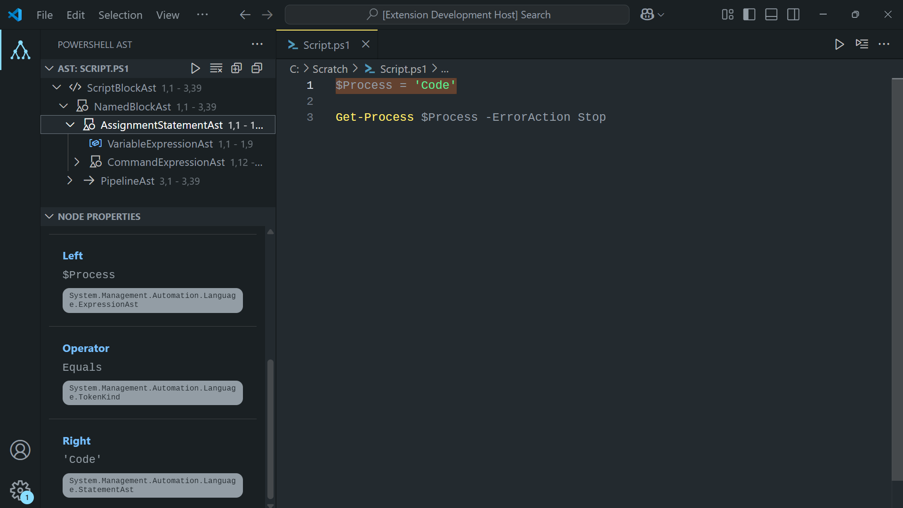
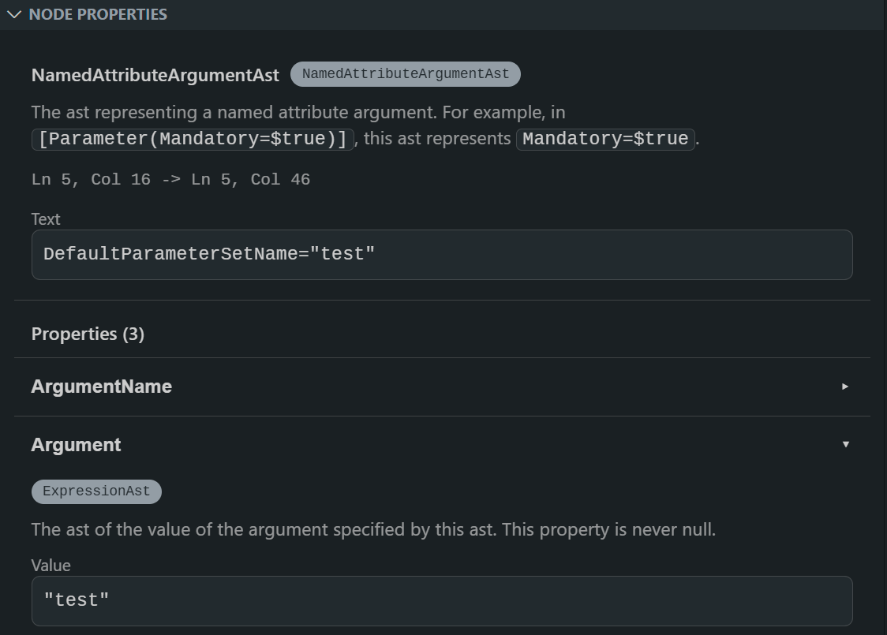
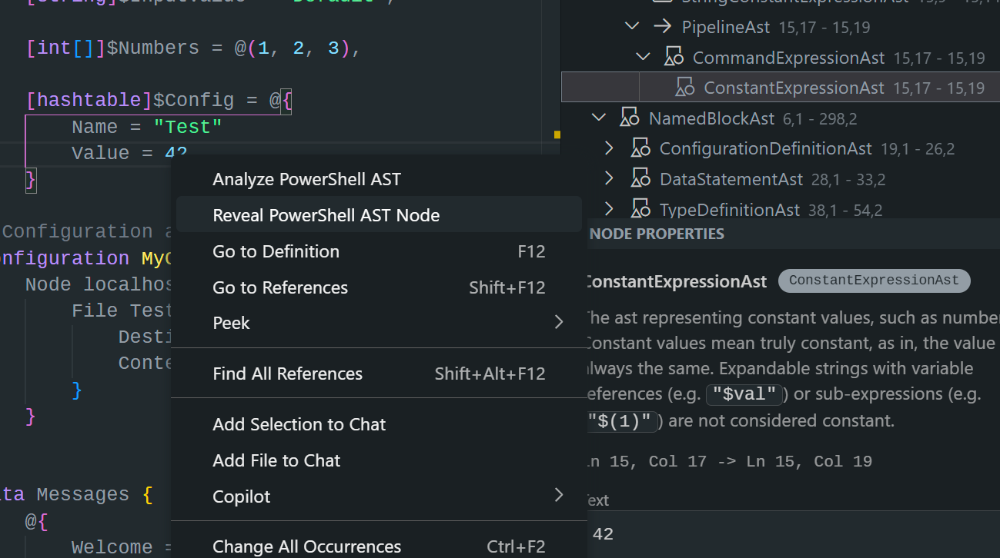

While working on PRs for PowerShell Script Analyzer, I find myself constantly
reaching for Jason Shirk's `ShowPSAst` project.



It analyses a PowerShell script using PowerShell's built-in parser and
displays the Abstract Syntax Tree (AST) in a user-friendly tree view.
It's handy for seeing how PowerShell sees a script under the hood.



It's a great tool to understand and quickly browse the AST representation, but
the reliance on Windows Forms means it can only be used on Windows.

I wanted to see if I could make something similar that was cross-platform.

## Blazor WebAssembly

My initial idea was the web; I thought it may be possible to use
[Blazor WebAssembly](https://learn.microsoft.com/en-us/aspnet/core/blazor/?view=aspnetcore-9.0).
My plan was to use the [PowerShell artifact](https://www.nuget.org/packages/PowerShell)
from NuGet to build a web-based version of the AST viewer. It would parse a
supplied script file and display the AST in a tree view format. Being a WASM
app, it would run entirely in the browser and could be served statically using
GitHub Pages.

Blazor WebAssembly, as it turns out, runs in the browser sandbox, only
supporting .NET assemblies compiled to WebAssembly and restricting access to
OS-level APIs. My plan was a non-starter.

## VSCode Extension

I use VSCode every day for PowerShell and had been using it to work on
PSScriptAnalyzer (as well as writing this blog). It seemed to me that a VSCode
extension would be a natural fit for building a cross-platform AST viewer. It
would have the added advantage of keeping me in the tool I was using anyway!

I started looking into the VSCode API and how to create a basic extension. It
seemed simple enough and there were certainly plenty of examples. I worked
through Hello World before moving on to prototyping.

Being able to spawn a PowerShell process and get output from it was critical.
There was no other way to obtain the AST. Thankfully, I found [a great blog post](https://appsupport.academy/powershell-tiny-project-11-a-marriage-made-in-heaven-nodejs-powershell)
filled with examples on spawning a PowerShell process from Node.js and getting
output back from it.

The plan was starting to come together. I envisioned something like:

- User triggers analysis of their script.

- We get the file contents of the script.

- We spawn a PowerShell process, running a PowerShell script which parses the
  file contents and produces a JSON representation of the AST.

- We use the returned AST, passed into Node.js land, to build
  the tree view representation (using the well documented [Tree View API](https://code.visualstudio.com/api/extension-guides/tree view)).

## PowerShell Analysis Script

This was the easy part. I'm a PowerShell developer day-to-day, so writing this
script was my bread and butter. That said, my first version was a little rough
and ready. It parsed the file and then recursively traversed the AST (starting
at the root) to build a tree structure, which it then spat out as JSON. Nodes
were represented as an object that had properties and an array of child nodes.
This had a few issues:

- Not every AST node was being captured, leading to an incomplete
  representation. I was checking each property of a node to see if it was an AST
  Node, and processing it if it was. Not super reliable.

- The recursion was also problematic. I could foresee a complex enough script
  being nested so much that I'd overflow the stack.

- The JSON output was *deeeeeep*! I set `-depth 20` for the output and still
  found fairly trivial scripts would trigger serialisation warnings.

The solution, in hindsight, was simple: find all nodes in the script, which
gave an array we could iterate over. For each node still capture the properties,
but also a hashcode of the node and its parent. That way we could keep
the JSON representation shallow, but easily rebuild the deep tree structure on
the Node.js side. This eliminated all 3 issues. We now had a way to supply a
script, analyse it, and return a JSON representation of the AST.

## Draw the Rest of the Owl

With the analysis script done, I turned my attention to the extension itself. I
am *woefully* underqualified to talk about this part. It's a bit of a
Frankenstein's monster of examples and snippets mashed together and re-worked
into what I needed. GitHub Copilot was involved as a code reviewer, providing
suggestions and helping to fill in gaps in my understanding, as well as
troubleshooting errors. One of the little niceties it suggested - and I took
wholesale - was the
[different icons for different node types](https://github.com/liamjpeters/PowerShell-AST-Inspector/blob/975aea0ddff6f0dea38cc1f8df5f7f2d2ccb8ac8/src/extension.ts#L249-L286)
in the tree view. This really helped with the overall usability of the extension
and made visually scanning the tree view far nicer.

With the tree view working, I added a WebView to display the properties of the
AST. When a node of the tree view is selected, the WebView is updated to show
information about that node, including its type, extents and properties.

Finally, for the initial version, I added in a right-click option for the tree
view. It highlights the relevant lines in the source editor for the selected AST
node.

The extension now functioned much the same as Jason's `ShowPsAst`. You could
analyse a script, see the AST in a tree view, click on nodes to see their
properties, and highlight the relevant lines in the source editor.



I [released version v0.1.0](https://github.com/liamjpeters/PowerShell-AST-Inspector/releases/tag/v0.1.0).

## Improvements

While using the extension in anger I noticed 3 areas for improvement.

### Node and Property Documentation
   
I would occasionally need to search the PowerShell GitHub repo to find out what
a particular node represented, or what a particular property of a node meant.
When working in a C# project, this information just pops up as an
IntelliSense tooltip.

I knew that C# must be getting the node and property documentation from
somewhere, and it wasn't too long before I worked out where. Within the
published NuGet package for PowerShell, there is an XML file that contains all
the documentation for types and properties in that package. Searching it for a
list of all the AST Node Types and their properties proved to be quite easy.

I realised that I could pre-gather the relevant documentation at extension build
time and include it in the extension package. I set about writing a script
that:

- Worked out the latest stable version of the PowerShell NuGet package.

- Downloaded the package.

- Extracted the XML documentation file from the package.

- Processed the XML to create a JSON file with the relevant documentation.

Soon enough I had [`GenerateAstDocs.ps1`](https://github.com/liamjpeters/PowerShell-AST-Inspector/blob/main/GenerateAstDocs.ps1)
which does exactly that. It spits out a JSON file into the `src` directory
alongside the extension files. The extension then loads this JSON file when it
first starts and can augment the AST data from the script analysis with this
documentation.



### Select Node from Source Code

You could right-click a node in the tree view and highlight the
relevant lines in the editor, but you couldn't do the reverse - right-click
the text and select the appropriate tree view node.

I wanted an option to be able to right-click in my PowerShell source file and
have the relevant node in the AST tree view be selected. This was a little
challenging, as all you have to go on with the right-click action is the row and
column location of the cursor (in reality a pair of these representing a
selection).

The solution was to walk the AST and find the node with the smallest length
that contained the selected location. I thought this was a clever idea and I
was pretty happy with myself. So far it seems to work well.

Once you find the node, it's a case of recursively expanding the tree view until
it's visible.



### Simplify Type Names

When a type name was displayed, it was fully assembly-qualified. This made
certain types painful to read and unwieldy to display.

Instead of:

```txt
System.Collections.Generic.Dictionary`2[[System.String, System.Private.CoreLib, Version=8.0.0.0, Culture=neutral, PublicKeyToken=7cec85d7bea7798e],[System.Tuple`2[[System.Management.Automation.Language.Token, System.Management.Automation, Version=7.4.6.500, Culture=neutral, PublicKeyToken=31bf3856ad364e35],[System.Management.Automation.Language.Ast, System.Management.Automation, Version=7.4.6.500, Culture=neutral, PublicKeyToken=31bf3856ad364e35]], System.Private.CoreLib, Version=8.0.0.0, Culture=neutral, PublicKeyToken=7cec85d7bea7798e]]
```

You only really want to see:

```txt
Dictionary[String, Tuple[Token, Ast]]
```

I straight-up asked Copilot how to do this. It came up with the kernel of
something - which almost worked. I corrected and tweaked until I got
[a function](https://github.com/liamjpeters/PowerShell-AST-Inspector/blob/975aea0ddff6f0dea38cc1f8df5f7f2d2ccb8ac8/GenerateAstDocs.ps1#L51-L112)
that would take in a potentially assembly qualified type name and spit out
something significantly more human-friendly. I know that it's not a technically
correct type name or syntax, but it works for the purposes of an inspection
tool.

## Wrap Up

It was a fun little experiment delving into a technical ecosystem that I knew
very little about. I enjoyed the process of figuring out each step and coming up
with a tool that I find very useful; Maybe others might too 😀.

It was also interesting to go through the process of
[publishing a VSCode extension](https://code.visualstudio.com/api/working-with-extensions/publishing-extension).
I get a little kick out of seeing my name in the marketplace.

Version v0.2.0 of the PowerShell AST Inspector is available now. It can be
downloaded from either [GitHub](https://github.com/liamjpeters/PowerShell-AST-Inspector/releases/tag/v0.2.0)
or [the VSCode Marketplace](https://marketplace.visualstudio.com/items?itemName=liamjpeters.powershell-ast-inspector).

The full source code is available on GitHub - PRs are welcome!



## 📖 Reading List

- [PowerShell.One Abstract Syntax Tree](https://powershell.one/powershell-internals/parsing-and-tokenization/abstract-syntax-tree)
- [PowerShell NuGet Package](https://www.nuget.org/packages/PowerShell)
- [VSCode: Your First Extension](https://code.visualstudio.com/api/get-started/your-first-extension)
- [PowerShell Tiny Project 11: A Marriage Made in Heaven - Node.js & PowerShell](https://appsupport.academy/powershell-tiny-project-11-a-marriage-made-in-heaven-nodejs-powershell)